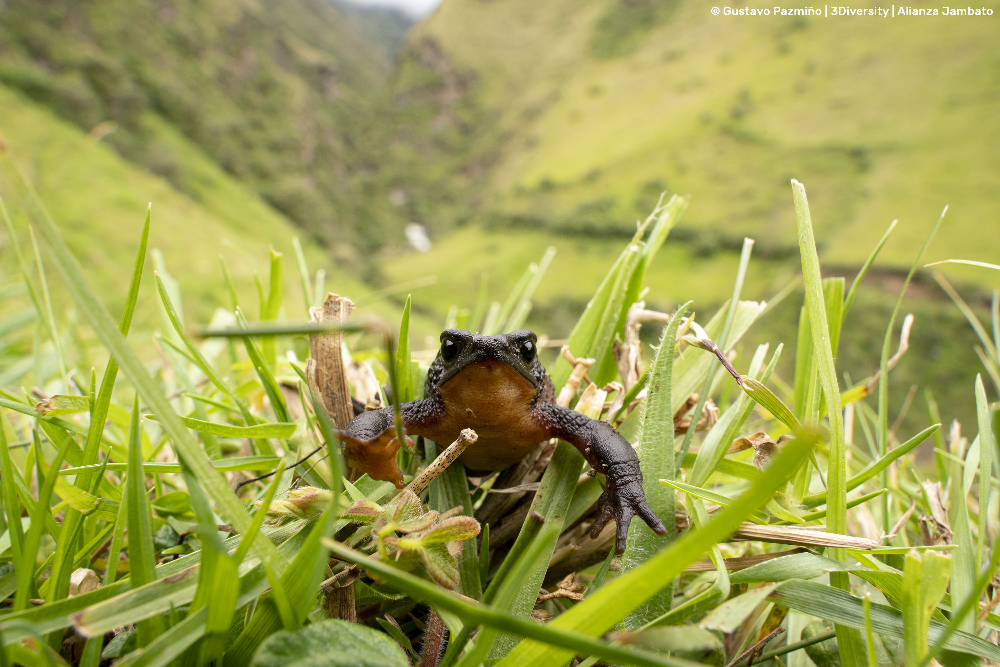

# Jambato Alliance (Alianza Jambato- AJ)
Official GitHub repository of Alianza Jambato, a 2021 initiative uniting institutions, organizations, researchers, and communities to conserve the critically endangered Jambato Harlequin Toad (Atelopus ignescens), endemic to Ecuador. This repository shares data and resources supporting our conservation efforts.
